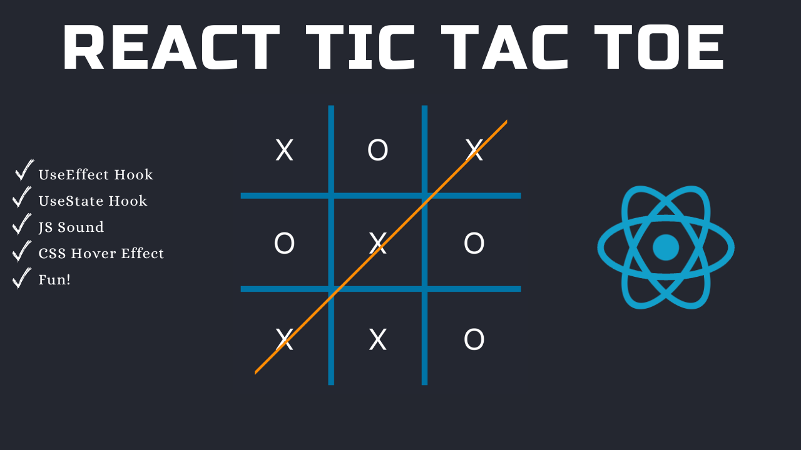

# Tic Tac Toe With React



### YouTube Tutorial:

https://youtu.be/4Gt_YyGf6B0?si=u8eITdczbHkTIY6e

### Try the game here:

https://codingwith-adam.github.io/tic-tac-toe-react/

In this Tutorial we are going to build an awesome version of Tic Tac Toe using React.

## 📦 Features

- **Interactive Gameplay:** Play against a friend or challenge yourself with the computer.
- **Responsive Design:** Enjoy a seamless experience on both desktop and mobile devices.
- **Easy to Use:** A clean and intuitive interface makes it easy for anyone to jump in and play.
- **Open Source:** Contribute to the project and help make it even better!

## 🛠️ Technologies Used

- **React.js:** The main framework used for building the user interface.
- **JavaScript:** The primary programming language for logic and functionality.
- **HTML & CSS:** For structuring and styling the application.

## 🚀 Getting Started

### Prerequisites

- Ensure you have [Node.js](https://nodejs.org/) installed on your machine.
- Familiarity with React.js is beneficial, but not required!

### Installation

1. Clone the repository:
   ```bash
   git clone https://github.com/yourusername/tic-tac-toe-online.git
   cd tic-tac-toe-online
   ```

2. Install dependencies:
   ```bash
   npm install
   ```

3. Start the development server:
   ```bash
   npm start
   ```

4. Open your browser and navigate to `http://localhost:3000` to start playing!

## 📈 Future Improvements

I'm continuously working to enhance this app. Upcoming features may include:

- Improved AI for single-player mode.
- Enhanced graphics and animations.
- User authentication and leaderboard features.

Stay tuned for updates!

## 🤝 Contributing

I welcome contributions from the community! If you'd like to help improve this project, please feel free to:

1. Fork the repository.
2. Create a new branch for your feature or bug fix.
3. Submit a pull request with a detailed description of your changes.

## 🙏 Acknowledgments

Thank you for checking out my project! I hope you enjoy playing Tic Tac Toe as much as I enjoyed creating it. If you have any feedback or suggestions, please don’t hesitate to reach out!

## 📫 Contact

Feel free to reach out with any questions or comments:

- **GitHub:** [Sumon-Mondal](https://github.com/Sumon-Mondal)
- **Email:** [sumonmondal0702@gmail.com](mailto:sumonmondal0702@gmail.com)

Happy gaming! 🎮
